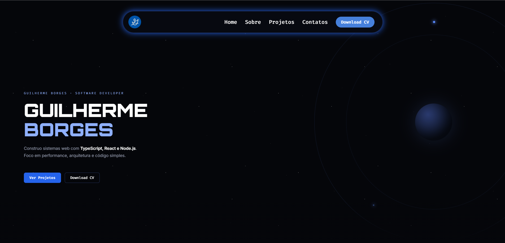

# 🚀 Guilherme Borges — Portfolio

> A space/nebula themed developer portfolio: dark mode, starfield, animated orbit and a technical typography (Fira Code + Orbitron).



## 📌 About the Project

**Guilherme Borges Portfolio** is a single-page personal portfolio built with **React, TypeScript, Vite and styled-components**, featuring a deep-space aesthetic: `#05060A` background with starfield, glassmorphism cards, blue accents (`#2563EB`, `#4680DB`, `#8FB0FF`) and technical fonts (**Orbitron** for headings, **Fira Code/Inter** for body text).

## ✨ Features

- 🌌 **Hero (Banner)** — Orbitron name, intro with the main stack and an **animated orbit** (planet + rings + glowing nodes with drift)
- 🎠 **Infinite skills marquee** — a strip of technology icons sliding in a continuous loop (pure CSS, no JS), pausing on hover
- 🏢 **About** — professional timeline (2023 → 2025/2026) with gradient line, glass cards and bio
- 📁 **Projects** — card grid with thumbnails, stack tags and Demo/GitHub buttons
- 📬 **Contacts** — info block (email, location, socials) + styled form with blue glow on focus
- 🧭 **Navbar** — anchor navigation + **Download CV** button (PDF bundled into the build via Vite)

## 🚀 Technologies

- **React.js** — component-based UI development
- **TypeScript** — static typing and safer code
- **Vite** — fast development build tool
- **styled-components** — CSS-in-JS with theme tokens (`src/styles/theme.ts`)
- **@phosphor-icons/react** — icon library
- **ESLint** — linting and code standards

## 🔜 In Development

- [ ] Soft fade on the skills marquee edges (gradient mask)
- [ ] Refined mobile responsiveness
- [ ] Contact form submission integration (backend/email)
- [ ] Live demo links for projects
- [ ] Cloud deployment

## 💻 Running Locally

```bash
# Clone the repository
git clone https://github.com/guiborgesw/portfolio-new.git

# Navigate to the project folder
cd portfolio-new

# Install dependencies
npm install

# Start the development server
npm run dev
```

Access at: http://localhost:5173

### Available scripts

| Script | Description |
|---|---|
| `npm run dev` | Dev server with HMR |
| `npm run build` | Type-check (`tsc -b`) + production build |
| `npm run preview` | Preview the production build locally |
| `npm run lint` | ESLint across the project |

## 📁 Project Structure

```
src/
├── components/
│   ├── Banner/       # Hero: name, orbit, skills marquee, navbar
│   ├── About/        # Professional timeline + bio
│   ├── Projects/     # Projects grid
│   └── Contacts/     # Info + form
├── data/             # Data (timeline, projects, skills)
├── styles/
│   ├── theme.ts      # Color tokens
│   └── globalStyles.ts # Global reset + starfield (body::before)
└── assets/           # Icons and CV PDF
```

**Methodology:** every component has its own `*.styles.ts` file with styled-components, colors always come from the `theme.ts` tokens, and data lives in `src/data/` — the UI only renders (`map`) what the data says.

## 👨‍💻 Author

**Guilherme Borges**

- 🔗 LinkedIn: [linkedin.com/in/guiborgesw](https://www.linkedin.com/in/guiborgesw)
- 🐙 GitHub: [github.com/guiborgesw](https://github.com/guiborgesw)
- 🌐 Portfolio: [guiborgesw.github.io/portfolio-guilherme-borges](https://guiborgesw.github.io/portfolio-guilherme-borges)

---

> Personal project — made with 💙 and lots of coffee.
